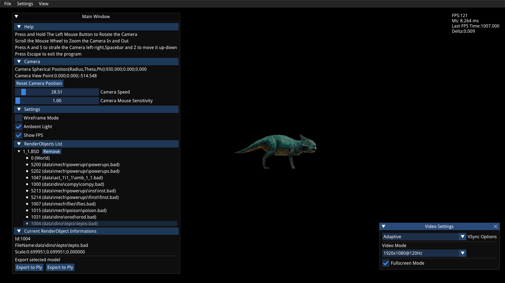

Jurassic Park:The Lost World PSX File Viewer
=============================

Table of contents
=================

* [Introduction](#introduction)
* [Build](#build)
* [Programs](#programs)
  + [JPModelViewer](#jpmodelviewer)
    - [Usage](#usage-1)
    - [Credits](#credits-1)
* [File Formats](#file-formats)
  + [Common Formats](#common-formats)
    - [TSB](#tsb)
  + [TSP Files](#tsp-files)
    - [TSP Nodes](#tsp-nodes)
      * [Vector3](#vector3)
      * [Bounding Box](#bounding-box)
      * [TSP Node](#tsp-node)
    - [Vertex](#vertex)
    - [Color](#color)
    - [Faces](#faces)
      * [UV Coordinates](#uv-coordinates)
  + [BSD Files](#bsd-files)
    - [File Format](#file-format)
      * [Animated Lights Block](#animated-lights-block)
      * [RenderObject Block](#renderobject-block)
        + [Color Mode](#color-mode)
        + [Texture Page](#texture-page)
        + [Vertex Data](#vertex-data)
      * [Vertex Data](#vertex-data-1)

## Introduction

This project contains a set of tools that can be used to view
Jurassic Park:The Lost World Level files and models.  
It was tested under Linux and Windows but it should also run on any other
platform.  
Game Files are not available into this repository and you need a copy of
the game in order to use it.  

Since the engine used by this game is an early version of the one used by
Medal of Honor, some file formats are compatible and can be opened with tools
available in this repository: https://github.com/AdrianoDiDio/Medal-Of-Honor-PSX-File-Viewer  
For example to load any TAF file or VAB/VB file the following tools can be used:
TIMTool and SoundExplorer.  

Some sample screenshot taken from JPModelViewer:  

*Screenshot taken from JPModelViewer showing the first level of jurassic park.*

*Screenshot taken from JPModelViewer showing one of the models contained inside the first level.*

## Build

Before building make sure to fetch all the submodules by typing:  

> git submodule update --init --recursive

then type:  

> mkdir Build && cd Build && cmake .. && cmake --build .

to build it.  
When the build is completed, the executables can be
found inside the Build/bin directory under a new folder
which has the same name as the executable (E.G:Build/bin/JPLevelViewer).  
The directories,created during the build process, will
contain everything that it is required by the program
in order to run properly.   

## Programs

### JPModelViewer

JPModelViewer is able to load and render any level and models from
the game Jurassic Park:The lost world.  
It is able to load level and models, that can be exported along to an Obj
or Ply file).
At the moment all the models are static and not animated.

#### Usage

> ./JPModelViewer `<Optional BSD file>`  

**NOTE: The configuration is stored in the User preference folder (.local/share/JPLevelViewer
on Linux and %AppData% on Windows).**  

#### Credits

JPModelViewer uses the following libraries:  

**SDL2**: https://www.libsdl.org/  
**zlib**: https://github.com/madler/zlib  
**libpng**:http://www.libpng.org/  
**IMGUI**: https://github.com/ocornut/imgui/  
**IMGUI_FileDialog**:  https://github.com/aiekick/ImGuiFileDialog  
**LibSampleRate**: https://github.com/libsndfile/libsamplerate  
The font file shipped with the program is:  
**DroidSans.ttf**: https://www.fontsquirrel.com/fonts/droid-sans

## File Formats

### Common Formats

#### TSB

It contains information about the texture.
It is a 16 bit number that has the following information:
Assuming we have 12299 as TSB number it can be seen in binary as:
0011000000001011
Starting from the left to right:
First 7 bits can be discarded leaving:

> 000001011

First 2 bits represents the TPF or Color Mode (00 4 bit,01 8 bit,10 15 bit):

> 00

Next 2 bits represents the Semi-Transparency rate.

> 00

Finally last 5 bits represent the VRAM page number (11 in this specific
case).

> 01011

### TSP Files

All TSP files starts with an header which contains the following data:  

| Type  | Size    | Description            |
| ----- | ------- | ---------------------- |
| short | 2 bytes | ID                     |
| short | 2 bytes | Version                |
| int   | 4 bytes | Number of TSP Nodes    |
| int   | 4 bytes | TSP Nodes Data Offset  |
| int   | 4 bytes | Number of Faces        |
| int   | 4 bytes | Faces Data Offset      |
| int   | 4 bytes | Number of Vertices     |
| int   | 4 bytes | Vertices Offset        |
| int   | 4 bytes | Number of Unknown Data |
| int   | 4 bytes | Unknown Data Offset    |
| int   | 4 bytes | Number of Colors       |
| int   | 4 bytes | Colors Data Offset     |
| int   | 4 bytes | Number of Unknown Data |
| int   | 4 bytes | Unknown Data Offset    |

**Note that for Jurassic park the version is always equals to 2**
**Note that all the offset starts from the beginning of the file.**  
Thanks to this format we can read each chunk separately by moving the file
pointer position to the required offset.

#### TSP Nodes

The game uses a ternary tree for rendering all the level data.  
Each TSP node contains the following data:

##### Vector3

| Type  | Size    | Description  |
| ----- | ------- | ------------ |
| short | 2 bytes | x coordinate |
| short | 2 bytes | y coordinate |
| short | 2 bytes | z coordinate |

##### Bounding Box

| Type                | Size    | Description |
| ------------------- | ------- | ----------- |
| [Vector3](#Vector3) | 6 bytes | Min         |
| [Vector3](#Vector3) | 6 bytes | Max         |

##### TSP Node

| Type                  | Size     | Description     |
| --------------------- | -------- | --------------- |
| [BBox](#Bounding-Box) | 12 bytes | Bounding Box    |
| int                   | 4 bytes  | Child1 Offset   |
| int                   | 4 bytes  | Child2 Offset   |
| int                   | 4 bytes  | Child3 Offset   |
| int                   | 4 bytes  | Face Offset     |
| short                 | 2 bytes  | Number Of Faces |
| short                 | 2 bytes  | Node type       |
| int                   | 4 bytes  | Unknown Offset  |

If the Number of faces is zero then this node could have a child and they
can be found by using the three offset.
Each child can have an offset equals to -1 in which case it means that it
is **NULL**.

If NumFaces is not zero then Face Offset represents the starting position where to load
the face array that goes from

> [Offset;Offset + (NumFaces * sizeof(Face))]

**Note that the face offset starts from the face offset declared in the header.**  
E.G: TSP Face offset is 64, Face Offset for the node is 24 then the child node will be
at **64+24**.

#### Vertex

| Type                | Size    | Description       |
| ------------------- | ------- | ----------------- |
| [Vector3](#Vector3) | 6 bytes | Vertex coordinate |
| short               | 2 bytes | Pad               |

#### Color

This is used by each face in order to simulate lights.

| Type          | Size   | Description |
| ------------- | ------ | ----------- |
| unsigned byte | 1 byte | Red         |
| unsigned byte | 1 byte | Green       |
| unsigned byte | 1 byte | Blue        |
| unsigned byte | 1 byte | Pad         |

#### Faces

##### UV Coordinates

Used for texture coordinates.

| Type          | Size   | Description  |
| ------------- | ------ | ------------ |
| unsigned char | 1 byte | u coordinate |
| unsigned char | 1 byte | v coordinate |

##### Face Data

Every face starts with an integer that represent the primitive type.  

There are 8 known primitive types that the game uses: 0,4,1,5,2,6,3,7  

Type 0,4,2 and 6 represents a non-textured triangle and the data will contain
only three integer that represents the 3 vertices.  

Type 1,5,3 and 7 represents a textured triangle and the data will contain
the following data:  

| Type                  | Size    | Description                                                                                  |
| --------------------- | ------- | -------------------------------------------------------------------------------------------- |
| unsigned short        | 2 bytes | V0 First vertex and color index in array                                                     |
| unsigned short        | 2 bytes | V1 Second vertex and color index in array                                                    |
| unsigned short        | 2 bytes | V2 Third vertex and color index in array                                                     |
| [UV](#uv-coordinates) | 2 byte  | UV0 Texture coordinate for vertex 0                                                          |
| short                 | 2 bytes | CBA (Contains CLUT Data for TIM Images)                                                      |
| [UV](#uv-coordinates) | 2 bytes | UV1 Texture coordinate for vertex 1                                                          |
| short                 | 2 bytes | TSB that contains info about the used texture (see [TSB](#tsb) section for more information) |
| [UV](#uv-coordinates) | 2 bytes | UV2 Texture coordinate for vertex 2                                                          |

### BSD Files

Each BSD files can be seen as a container for multiple file types
(Levels,Weapons,Players).

#### File Format

Every BSD file starts with a 2048 bytes header that can be ignored and
probably contains a list of CD sectors that were required by the PSX in
order to correctly read the file.  
**Note that all the offset contained inside the file starts from 2048.**

##### Animated Lights Block

This block is found at position 64 (excluding the header) or 2112
(including the header) and contains information about animated lights that
can be used by the TSP file in order to render special effects like running
water from a river,a blinking light etc...  
Each animated lights is contained in a structure that has a fixed size of
20 bytes:

| Type | Size    | Description         |
| ---- | ------- | ------------------- |
| int  | 4 bytes | NumColors           |
| int  | 4 bytes | StartingColorOffset |
| int  | 4 bytes | ColorIndex          |
| int  | 4 bytes | CurrentColor        |
| int  | 4 bytes | Delay               |

Every animated light has a number of colors that are loaded at the
specified StartingColorOffset (to which you would add 4-bytes until all
colors are read).  
Each color is just a 4-byte integer that represents the 3 components (RGB)
plus a constant value that it is used to restart the animation ( by setting
the Delay value to this constant ).   
Every frame the animated light structure is updated only if the Delay
reaches zero, after which the ColorIndex is incremented wrapping around
only when it reaches the maximum value represented by NumColors.  
ColorIndex is used to select the current color that will be used by the
surface during rendering time.    
The list of colors can be actually found after the RenderObject block and
it is not meant to be read sequentially but loaded when parsing this
block.   

##### RenderObject Block

At the offset 0x1D8 (472) after the header,we find the number of
RenderObject stored as an int (4 bytes).  
A RenderObject, as the name implies, are all the objects that can be
rendered by the game (the main level, models, powerups etc...)  
Each RenderObject has a fixed size of 2124 bytes containing several fields
that, depending by the type of the RenderObject, can be NULL or contains an offset to the data stored inside the BSD file.    

| Type           | Size     | Description                                                        |
| -------------- | -------- | ------------------------------------------------------------------ |
| unsigned int   | 4 bytes  | ID                                                                 |
| int            | 4 bytes  | Unknown Offset (Valid if not 0)                                    |
| int            | 4 bytes  | Animation Data Offset (Valid if not -1)                            |
| int            | 4 bytes  | TSP data offset (Valid if not 0)                                   |
| byte           | 12 bytes | Unknown data                                                       |
| int            | 4 bytes  | Face Data Offset                                                   |
| int            | 4 bytes  | Non-textured Face Data Offset                                      |
| int            | 4 bytes  | Face Data Offset                                                   |
| int            | 4 bytes  | Textured Face Data Offset                                          |
| int            | 4 bytes  | Non-textured Face Data Offset                                      |
| int            | 4 bytes  | Textured Face Data Offset                                          |
| byte           | 70 bytes | Unknown                                                            |
| int            | 4 bytes  | Vertex Offset                                                      |
| int            | 2 bytes  | Number of Vertices                                                 |
| byte           | 32 bytes | Unknown data                                                       |
| int            | 4 bytes | ScaleX                                                              |
| int            | 4 bytes | ScaleY                                                              |
| int            | 4 bytes | ScaleZ                                                              |
| byte           | 1816 bytes | Unknown data                                                     |
| byte           | 132 bytes | File Name                                                         |

**NOTE that ScaleX/Y/Z Values must be divided by 16 and the value found is
in fixed point format where 4096 is equal to 1.**

Textured face data contains two identical data structure followed by the
encoded vertex indices:  

| Type                  | Size    | Description                |
| --------------------- | ------- | -------------------------- |
| int                   | 4 bytes | Tag (Used by PSX)          |
| [Color](#Color)       | 4 bytes | Color of Vertex 0          |
| short                 | 2 bytes | X Screen Coordinate of Vertex 0 |
| short                 | 2 bytes | Y Screen Coordinate of Vertex 0 |
| [UV](#uv-coordinates) | 2 bytes | UV Coordinates of Vertex 0 |
| short                 | 2 bytes | CBA (Contains CLUT Data for TIM Images)|
| [Color](#Color)       | 4 bytes | Color of Vertex 1          |
| short                 | 2 bytes | X Screen Coordinate of Vertex 1 |
| short                 | 2 bytes | Y Screen Coordinate of Vertex 1 |
| [UV](#uv-coordinates) | 2 bytes | UV Coordinates of Vertex 1 |
| short                 | 2 bytes | Texture Info               |
| [Color](#Color)       | 4 bytes | Color of Vertex 2          |
| short                 | 2 bytes | X Screen Coordinate of Vertex 2 |
| short                 | 2 bytes | Y Screen Coordinate of Vertex 2 |
| [UV](#uv-coordinates) | 2 bytes | UV Coordinates of Vertex 2 |
| short                 | 2 bytes | Pad |
| unsigned int          | 4 bytes | Vertex Data                |

non-textured faces use a simplified structure:  

| Type                  | Size    | Description                |
| --------------------- | ------- | -------------------------- |
| int                   | 4 bytes | Tag (Used by PSX)          |
| [Color](#Color)       | 4 bytes | Color of Vertex 0          |
| short                 | 2 bytes | X Screen Coordinate of Vertex 0 |
| short                 | 2 bytes | Y Screen Coordinate of Vertex 0 |
| [Color](#Color)       | 4 bytes | Color of Vertex 1          |
| short                 | 2 bytes | X Screen Coordinate of Vertex 1 |
| short                 | 2 bytes | Y Screen Coordinate of Vertex 1 |
| [Color](#Color)       | 4 bytes | Color of Vertex 2          |
| short                 | 2 bytes | X Screen Coordinate of Vertex 2 |
| short                 | 2 bytes | Y Screen Coordinate of Vertex 2 |
| unsigned int          | 4 bytes | Vertex Data                |

###### Color Mode

> (TexInfo & 0xC0) >> 7

For the result value read about [TSB](#TSB) since it uses the same format.

###### Texture Page

> TexInfo & 0x3f or TexInfo if loading FaceV2 (for MOH:Underground)

For the result value read about [TSB](#TSB) since it uses the same format.

###### Vertex Data

Vertex Data contains the information about the indices used to create the triangle that represent the current face and It has the following format:

**Vertex 0**

> VertexData & 0xFF

**Vertex 1**

> (VertexData & 0x3fc00) >> 10

**Vertex 2**

> (VertexData & 0xFF00000) >> 20

##### Vertex Data

Each vertex is a simple Vector3 containing three coordinates and a
pad value.    

| Type  | Size    | Description |
| ----- | ------- | ----------- |
| short | 2 bytes | x           |
| short | 2 bytes | y           |
| short | 2 bytes | z           |
| short | 2 bytes | Pad         |
